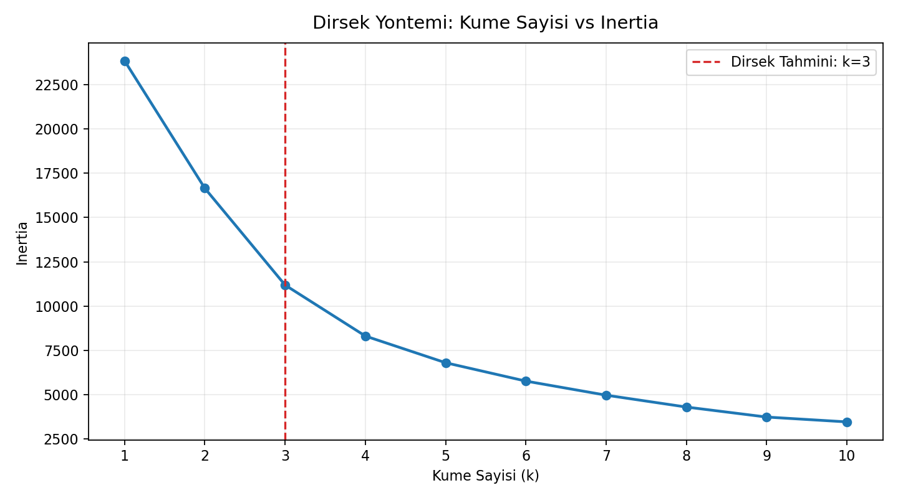
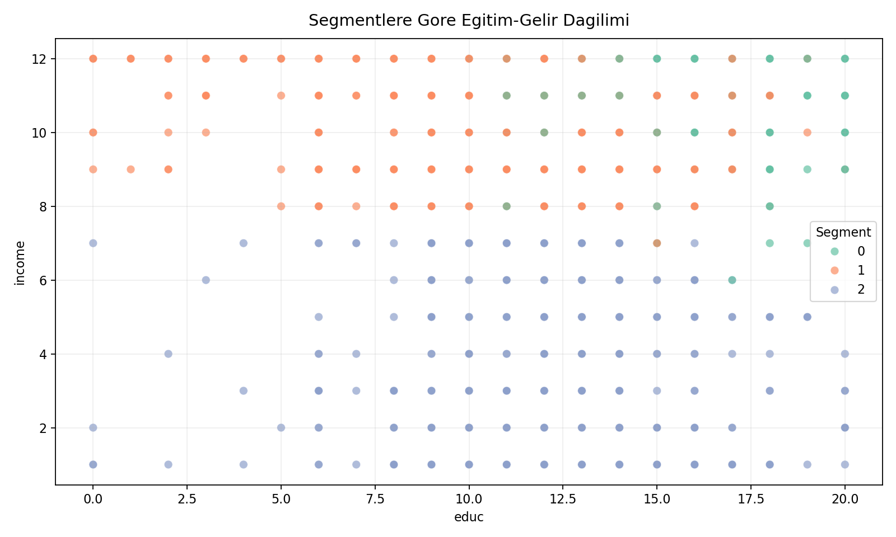

# GSS Calisma Ozeti

Bu dosya, gss klasoru icinde tamamlanan tum calismalari okunabilir ve takip edilebilir bir formatta ozetler.

## 1. Klasor Kapsami

Bu klasorde bulunan ana calisma dosyalari:

1. [02_model_hazirlama.ipynb](02_model_hazirlama.ipynb)
2. [risk_modeli.ipynb](risk_modeli.ipynb)
3. [segmentasyon_modeli.ipynb](segmentasyon_modeli.ipynb)
4. [temiz_veri.csv](temiz_veri.csv)
5. [gss_2010_ve_sonrasi.csv](gss_2010_ve_sonrasi.csv)
6. [feature_importance_plot.png](feature_importance_plot.png)
7. [assets/elbow_method.png](assets/elbow_method.png)
8. [assets/segment_scatter.png](assets/segment_scatter.png)

## 2. 02 Model Hazirlama Calismasi

Dosya: [02_model_hazirlama.ipynb](02_model_hazirlama.ipynb)

Bu notebookta yapilan ana islemler:

1. Veri yukleme ve temel on isleme adimlari
2. Modelleme icin bagimli/bagimsiz degisken ayrimi
3. Birden fazla regresyon modelinin denenmesi
4. Performans metrikleri ile model karsilastirma
5. Sonuclarin tablo ve grafiklerle yorumlanmasi

Not: Bu notebookta bir hucre hata ile sonlanmis gorunuyor; kalan adimlarin buyuk bolumu calistirilmis durumda.

## 3. Risk Tahmini Calismasi

Dosya: [risk_modeli.ipynb](risk_modeli.ipynb)

Yapilanlar:

1. Veri setinin temizlenmesi ve hedef degiskenin uretilmesi
2. Train/Test ayrimi
3. RandomForestClassifier modeli kurulumu ve egitimi
4. Test seti uzerinde tahmin uretimi
5. Asagidaki metriklerin hesaplanmasi:
   Accuracy, Classification Report, Confusion Matrix
6. Feature importance analizi
7. Sonuclarin markdown ile yorumlanmasi

Elde edilen temel metrik:

1. Accuracy: 0.6377

## 4. Davranissal Segmentasyon Calismasi

Dosya: [segmentasyon_modeli.ipynb](segmentasyon_modeli.ipynb)

Yapilanlar:

1. Segmentasyon degiskenlerinin secimi: income, educ, satfin
2. StandardScaler ile olcekleme ve X_scaled olusturma
3. Elbow Method ile optimum kume sayisinin belirlenmesi
4. KMeans modeli ile segment etiketlerinin uretilmesi
5. Segment etiketlerinin veri setine Segment sutunu olarak eklenmesi
6. Segment bazli ortalama profil tablosu
7. educ-income duzleminde seaborn scatter plot
8. Pazarlama ve YBS odakli segment yorumlari
9. README icin grafiklerin dosyaya aktarilmasi

Temel segmentasyon sonuclari:

1. Optimum kume sayisi: 3
2. Segment dagilimi:
   Segment 0: 3552
   Segment 1: 3913
   Segment 2: 482

## 5. Uretilen Gorseller

1. Elbow grafigi: [assets/elbow_method.png](assets/elbow_method.png)
2. Segment scatter grafigi: [assets/segment_scatter.png](assets/segment_scatter.png)
3. Feature importance grafigi: [feature_importance_plot.png](feature_importance_plot.png)

## 6. Is Degeri ve Aksiyon Ciktilari

Calismalarin is tarafina donuk cikarimlari:

1. Risk tahmini ile riskli profillerin daha erken tespiti
2. Segmentasyon ile hedef kitlenin personaya ayrilmasi
3. Segment bazli kampanya ve urun stratejisi olusturma
4. Butcenin daha yuksek geri donuslu segmentlere yonlendirilmesi

## 7. Calistirma Sirasi

Notebooklari tekrar calistirmak icin onerilen sira:

1. [02_model_hazirlama.ipynb](02_model_hazirlama.ipynb)
2. [risk_modeli.ipynb](risk_modeli.ipynb)
3. [segmentasyon_modeli.ipynb](segmentasyon_modeli.ipynb)

## 8. Kisa Notlar

1. Hucreler sirayla calistirildiginda degisken bagimliliklari sorunsuz ilerler.
2. Sonuclar veri guncellemelerine bagli olarak degisebilir.
3. Model basarisi, hiperparametre optimizasyonu ile artirilabilir.
# 02 Model Hazirlama README

Bu dosya, [02_model_hazirlama.ipynb](02_model_hazirlama.ipynb) notebooku icinde yapilan tum model hazirlama adimlarini ozetler.

## Amac

[02_model_hazirlama.ipynb](02_model_hazirlama.ipynb) calismasinin amaci iki parcadan olusur:

1. Kotu saglik riskini siniflandirma modeli ile tahmin etmek
2. Davranissal segmentasyon ile hedef kitleyi personalara ayirmak

## Veri Kaynaklari

- [temiz_veri.csv](temiz_veri.csv)
- [gss_2010_ve_sonrasi.csv](gss_2010_ve_sonrasi.csv)

## 02 Notebook Icerigi

### 1. Veri Hazirlama

- Temel kutuphaneler yuklendi
- Veri seti okundu
- Modelleme icin gerekli degiskenler secildi

### 2. Risk Tahmini (Random Forest)

- Egitim/test ayrimi yapildi
- RandomForestClassifier kuruldu ve egitildi
- Asagidaki metrikler hesaplandi:
  - Accuracy
  - Classification Report
  - Confusion Matrix

### 3. Degisken Onemlilikleri

- Feature importances hesaplandi
- Kotu saglik riskine etki eden faktorlerin goreli onemi yorumlandi

### 4. Segmentasyon (K-Means)

- income, educ, satfin degiskenleri secildi
- StandardScaler ile olcekleme yapildi
- Elbow Method ile optimum kume sayisi secildi
- Nihai KMeans modeli kuruldu ve Segment sutunu uretildi

### 5. Segment Analizi

- Segment bazli ortalama profil tablosu olusturuldu
- educ (x) ve income (y) uzerinden scatter plot cizildi
- Segmentler is dunyasina uygun adlarla yorumlandi

## Sonuclar (02 Notebook Ciktilari)

### Risk Modeli

- Random Forest Accuracy: 0.6377

### Segmentasyon

- Optimum kume sayisi: 3
- Segment dagilimi:
  - Segment 0: 3552
  - Segment 1: 3913
  - Segment 2: 482

## Gorseller

### Elbow Method

### Segment Scatter

### Feature Importance

## Is Degeri ve Aksiyon

- Riskli profillerin erken tespiti ile operasyonel risk azaltimi
- Persona bazli segmentasyon ile daha hedefli kampanya tasarimi
- Pazarlama butcesinin yuksek geri donuslu segmentlere yonlendirilmesi

## Calistirma Notu

Bu README, [02_model_hazirlama.ipynb](02_model_hazirlama.ipynb) icin hazirlanmistir. Sonuclarin tekrar uretilebilmesi icin notebook hucreleri sirayla calistirilmalidir.
